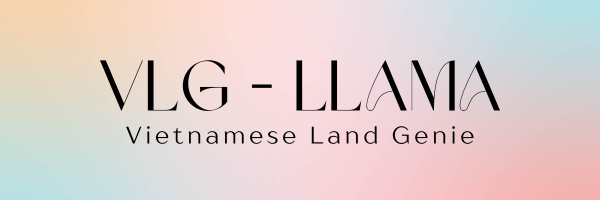
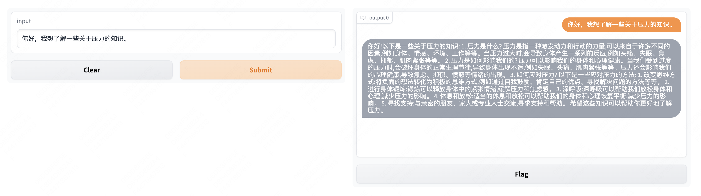
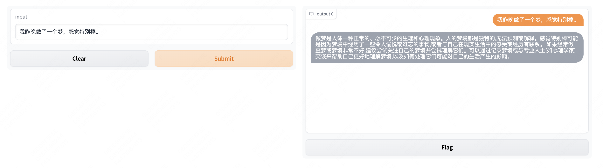
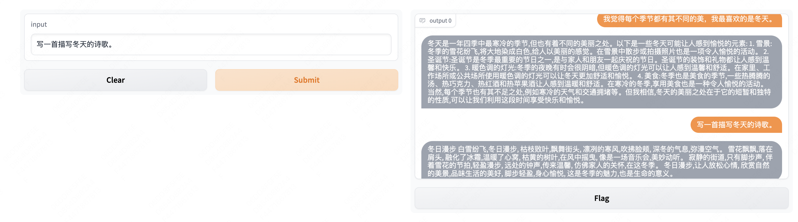

<p align="center">
     
     <br/>
</p> 

# VLG-LLaMA: Vietnamese Land Genie - LLaMA

This project aims to make LLaMa understand Vietnamese, and can generate fluency Vietnamese. We are inspired that LLaMa have learned good English expression and a little alignment prompt can makes it capture Vietnamese. 

- [X] Token vocabulary support for multi-language. We found that llama tokenizer naturally support for Vietnamese. 
- [X] Fine-tuning llama script.  

  (1) download original ckpt from [huggingface](https://huggingface.co/decapoda-research/llama-7b-hf), and put them into file path ```ckpt```. 

  (2) ```train.py``` original script must be run on 80G A100 and more techniques should be employed. 
  
  (3) ```train_lora.py``` lora fine-tuning using [peft](https://github.com/huggingface/peft). 
  
  | Argument | Values |
  |------|------|
  | `batch size` | 128 * 8 |
   | `epochs` | 3 |
   | `cut length` | 256 |
   | `learning rate` | 2e-5 |
   | `speed` | 1.02s / it |
  
  
- [X] Fine-grained english-vietnamese alignment dataset. We colleced the high-quality English-Vietnamese pairs and can be download in [Github](https://github.com/VinAIResearch/PhoMT). 

[//]: # (     We also found that [BELLE]&#40;https://github.com/LianjiaTech/BELLE&#41; provide ckpts and inese dataset, strongly recommended to refer it. )

- [X] Instructing tuning. We use [vietnamese alpaca](https://github.com/telexyz/GPT4VN) for instructing tunning. 

[//]: # (- [X] Open source [checkpoints]&#40;https://huggingface.co/feizhengcong/MLE-LLaMA/blob/main/README.md&#41;, gradio scripts and cases. )

[//]: # (     We found that LLaMA model tends to generate long sentences. )

[//]: # (<p align="center">)

[//]: # (     )

[//]: # (     <br/>)

[//]: # (</p> )

[//]: # ()
[//]: # (<p align="center">)

[//]: # (     )

[//]: # (     <br/>)

[//]: # (</p> )

[//]: # ()
[//]: # (<p align="center">)

[//]: # (     )

[//]: # (     <br/>)

[//]: # (</p> )


## Reference 
[1] https://github.com/facebookresearch/llama 

[2] https://github.com/tatsu-lab/stanford_alpaca 

[3] https://github.com/huggingface/transformers/tree/main/examples/pytorch/language-modeling

[4] https://github.com/tloen/alpaca-lora

[5] https://github.com/telexyz/GPT4VN

